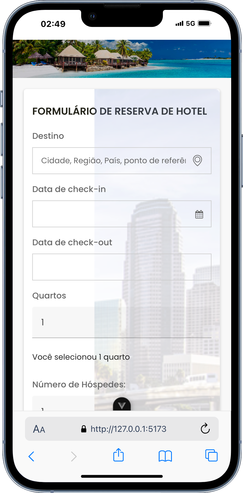
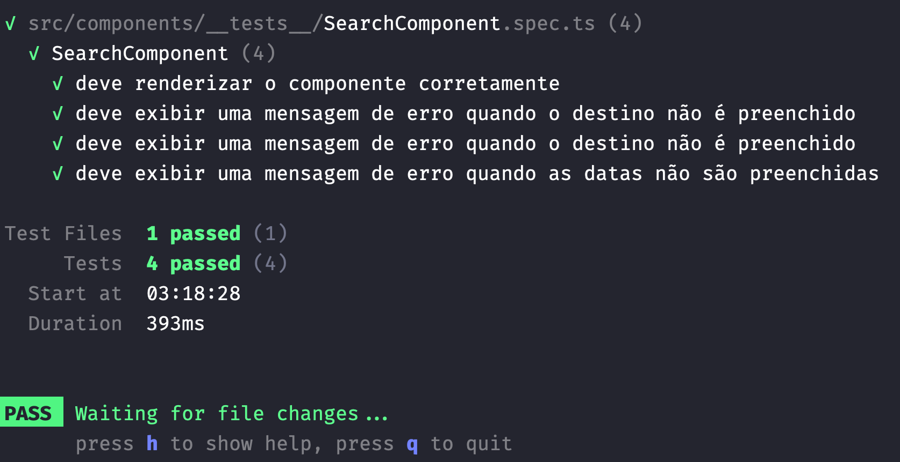
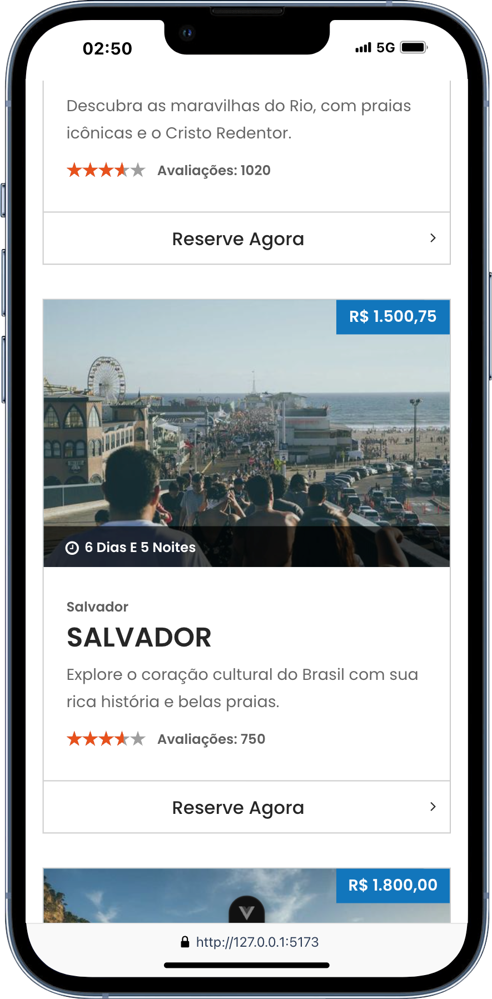

# Developer NTConsult Hotel

[]()
[]()
[]()
[]()
[](https://github.com/JeanPaulll/developer-test-ntconsult-hotel)
[]()

## Objetivo do Projeto

Este projeto foi desenvolvido como parte de um teste prático de desenvolvimento front-end, com o objetivo de simular parte de um sistema de reservas de hotéis. O foco foi na criação de uma interface funcional que permite aos usuários pesquisar, comparar e reservar hotéis de maneira simples e eficiente.


O projeto está disponível para teste no seguinte link:
[NTConsult Hotel Test Application](https://ntconsult-hotel-test-developer.netlify.app/)





## Requisitos Implementados

### 1. Pesquisa de Hotéis

- Implementada uma interface onde o usuário pode inserir critérios de pesquisa, como destino, datas de check-in e check-out, número de quartos e número de hóspedes.
- Resultados da pesquisa exibidos em uma lista que pode ser ordenada por diferentes critérios, como preço e avaliações.

### 2. Comparação de Hotéis

- Adicionada funcionalidade para que o usuário possa selecionar múltiplos hotéis dos resultados de busca e compará-los lado a lado, facilitando a escolha do melhor hotel.

### 3. Notificações

- Incluído um sistema de notificações que informa o usuário sobre o status da sua reserva, garantindo transparência e segurança durante o processo.


## Detalhes Técnicos

- **Framework:** Utilizado Nuxt 3 para construir a aplicação, aproveitando a Composition API para uma estrutura de código mais organizada.
- **Linguagem:** TypeScript foi utilizado para tipagem estática, garantindo maior segurança e qualidade no desenvolvimento.
- **Gerenciamento de Estado:** Pinia foi utilizado para gerenciar a autenticação e outras funcionalidades relacionadas ao estado da aplicação.
- **Estilização:** Tailwind (Não aplicado) CSS foi utilizado para estilizar as páginas, proporcionando uma interface moderna e responsiva.
- **Mock de API:** Implementadas chamadas de API simuladas via SSR para busca e reserva de hotéis.
- **Otimização:** Aplicação otimizada com Lazy Loading e Code Splitting para melhorar o desempenho.
- **CI/CD:** Pipeline básico de CI/CD configurado utilizando GitHub Actions para automatizar testes e deploys.

## Funcionalidades Adicionais

- **Filtro Avançado de Destinos:** A pesquisa de destinos foi aprimorada para ignorar acentos e permitir a busca por termos parciais, como "rio", que retornará resultados como "Rio de Janeiro".
- **Componentes Reutilizáveis:** Desenvolvidos componentes reutilizáveis para otimizar o desenvolvimento e a manutenção do código.

## Instruções de Instalação e Execução

### Setup do Projeto

1. Clone o repositório:
   ```bash
   git clone https://github.com/JeanPaulll/developer-test-ntconsult-hotel.git
   cd developer-ntconsult-hotel
   ```

2. Instale as dependências:
   ```bash
   npm install
   ```

3. Execute o projeto em ambiente de desenvolvimento:
   ```bash
   npm run dev
   ```

### Testes

- Para executar os testes unitários:
  ```bash
  npm run test:unit
  ```

- 


- Para executar os testes de integração (E2E):
  ```bash
  npm run test:e2e
  ```

### Deploy

O projeto está disponível para teste no seguinte link:

### https://ntconsult-hotel-test-developer.netlify.app/
[](https://app.netlify.com/sites/ntconsult-hotel-test-developer/deploys)



## Estrutura do Projeto

- **Componentes:** Desenvolvidos seguindo as melhores práticas do Vue, com uso de Composition API para maior flexibilidade.
- **Estilização:** Implementada com Tailwind CSS, proporcionando uma interface consistente e responsiva.
- **Gerenciamento de Estado:** Pinia foi utilizado para gerenciar o estado global da aplicação.

## Author

[@JeanPaul](https://twitter.com/jeanpaullx) – jeanpaulwebb@gmail.com

[]()

## Considerações Finais

Este projeto demonstra a aplicação de conhecimentos em Vue.js, Nuxt 3, e TypeScript para criar uma interface de usuário moderna e funcional, capaz de atender às necessidades de um sistema de reservas de hotéis. A implementação foca na usabilidade, performance e qualidade de código, garantindo uma experiência positiva para o usuário final.


